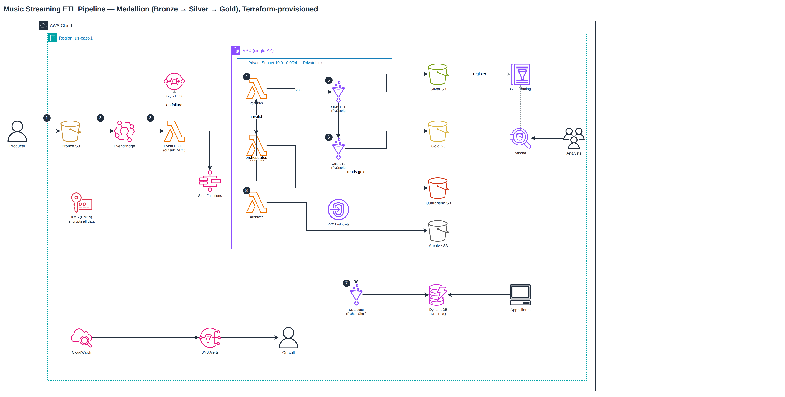

# Music Streaming Data Pipeline

A production-ready, event-driven serverless ETL pipeline on AWS that ingests music streaming events, validates them, transforms them through a medallion architecture (Bronze → Silver → Gold), and serves KPIs via DynamoDB and Athena.

---

## Architecture



> The **VPC (single-AZ)** container encloses an explicit **Private Subnet 10.0.10.0/24 — PrivateLink** box that holds the Validator, Quarantine, and Archiver Lambdas plus the Silver and Gold Glue jobs. The Event Router Lambda and the DDB-Load Python Shell job sit outside the VPC by design (see steps 2–3 and 7 below).

### Diagram Walkthrough

The numbered badges in the diagram correspond to the main pipeline flow steps:

1. **Raw landing:** The producer uploads raw music-streaming CSV/JSON files into the Bronze S3 bucket — the immutable source of truth. An S3 Object Created event is emitted automatically.
2. **Event routing:** EventBridge captures the S3 `Object Created` event and invokes the **Event Router Lambda** (outside the VPC). If delivery fails after retries, the event is captured in the **SQS dead-letter queue** so nothing is silently lost.
3. **Orchestration trigger:** The Event Router calls Step Functions `StartExecution`, handing off the payload (bucket + key + run date). Step Functions (Standard) orchestrates every subsequent step.
4. **Validation (in VPC):** The **Validator Lambda** (inside the private subnet) inspects the file for required fields and schema. Invalid files are routed to the **Quarantine Lambda**, which moves them to Quarantine S3 and fires an SNS alert.
5. **Silver curation (in VPC):** The **Silver Glue PySpark job** (NETWORK-connected to the private subnet) reads Bronze, applies explicit schemas, cleanses, deduplicates, type-casts, and writes partitioned Parquet to Silver S3. Results are registered in the Glue Data Catalog.
6. **Gold aggregation (in VPC):** The **Gold Glue PySpark job** reads Silver and computes the daily KPIs: listen counts, unique listeners, total/avg listening time per genre, top 3 songs per genre per day, and top 5 genres per day. Output is partitioned Parquet in Gold S3.
7. **KPI serving (outside VPC):** The **DDB-Load Glue Python Shell job** reads the Gold Parquet files (pyarrow) and batch-writes the KPIs into DynamoDB tables for low-latency application lookups. It runs outside the VPC because it installs `pyarrow` from PyPI at startup, which needs internet access the no-NAT private subnet cannot provide.
8. **Archival (in VPC):** The **Archiver Lambda** (inside the private subnet) moves processed Bronze files to Archive S3 (Glacier Deep Archive). It fails loud on any error so Step Functions can `Catch` and alert rather than report a false success.
### Data Flow

| Layer  | Format  | Description                                       |
|--------|---------|---------------------------------------------------|
| Bronze | JSON    | Raw streaming events, immutable source of truth   |
| Silver | Parquet | Cleaned, typed, deduplicated, dimension-enriched  |
| Gold   | Parquet | Aggregated KPIs (listens by genre, top songs, etc)|
| DDB    | DynamoDB| Hot-path KPI serving for application consumption  |

### Pipeline Stages

1. **Ingestion** — S3 PutObject on bronze bucket → EventBridge → Event Router Lambda → Step Functions
2. **Validation** — Validator Lambda checks required fields, detects schema drift, writes DQ reports to DynamoDB
3. **Quarantine** — Invalid files are copied to quarantine bucket and tagged; SNS notification is sent
4. **Silver ETL** — Glue PySpark job cleanses, deduplicates, type-casts, and partitions data
5. **Gold ETL** — Glue PySpark job aggregates daily KPIs (genre counts, top 3 songs/genre, top 5 genres)
6. **DDB Load** — Glue **Python Shell** job (pyarrow + boto3) batch-writes gold aggregates into DynamoDB tables for low-latency queries
7. **Archive** — Archiver Lambda moves processed bronze files to long-term archive (Glacier Deep Archive)
8. **Alerting & DLQ** — SNS notifications on validation/pipeline failures; failed EventBridge→router deliveries and async router failures are captured in an SQS dead-letter queue with bounded retries

---

## Tech Stack

| Layer | Service |
|---|---|
| Orchestration | AWS Step Functions (Standard) |
| Transformation | AWS Glue (PySpark + Python Shell), Glue Data Catalog |
| Storage | Amazon S3 (JSON, Parquet), DynamoDB (on-demand) |
| Eventing | Amazon EventBridge, Amazon SQS (dead-letter queue) |
| Compute | AWS Lambda (Python 3.11, VPC-attached) |
| Analytics | Amazon Athena |
| Security | KMS (CMKs), IAM (least privilege), VPC + PrivateLink endpoints (single-AZ for cost) |
| Observability | CloudWatch (logs, metrics, alarms, dashboard), X-Ray |
| Notifications | Amazon SNS |
| IaC | Terraform 1.7+, modular composition |
| CI/CD | GitHub Actions (terraform validate + plan, pytest; least-privilege OIDC role) |

---

## Repository Layout

```
music-streaming-data-pipeline/
├── terraform/
│   ├── bootstrap/              # State backend (S3 + DynamoDB + KMS + GitHub OIDC)
│   ├── envs/dev/               # Root Terraform composition for dev environment
│   └── modules/
│       ├── athena/             # Athena workgroup for ad-hoc analytics
│       ├── dynamodb-kpi/       # KPI DynamoDB tables (hourly/daily/monthly + DQ reports)
│       ├── eventbridge/        # EventBridge rule: S3 PutObject → Lambda
│       ├── glue-catalog/       # Glue Data Catalog databases and tables
│       ├── glue-jobs/          # Glue job defs + PySpark (silver/gold) & Python Shell (ddb) scripts + NETWORK connection
│       ├── iam-roles/          # All IAM roles and policies (least privilege)
│       ├── kms/                # KMS CMKs for S3, DynamoDB, Glue, logs
│       ├── lambda-functions/   # Lambda functions + handler code
│       ├── networking/         # VPC, private subnet(s), security groups, VPC endpoints (single-AZ default)
│       ├── observability/      # CloudWatch dashboard and metric alarms
│       ├── s3-data-lake/       # S3 buckets (bronze/silver/gold/quarantine/archive/glue-scripts/athena-results/access-logs)
│       └── step-functions/     # Step Functions state machine definition
├── scripts/
│   ├── produce_streams.py      # Simulates streaming data ingestion
│   └── produce_example.sh      # Example script invocations
├── tests/
│   ├── conftest.py             # Pytest configuration (sys.path, fixtures)
│   ├── requirements.txt        # Test dependencies
│   ├── test_event_validator.py # Validator Lambda tests
│   ├── test_event_router.py    # Event Router Lambda tests
│   ├── test_quarantine_handler.py # Quarantine Handler Lambda tests
│   ├── test_stream_archiver.py # Stream Archiver Lambda tests
│   └── test_ddb_etl.py         # DDB-load Python Shell job tests
├── data/                       # Sample data (users.csv, songs.csv, streams*.csv)
├── .github/workflows/
│   └── terraform.yml           # CI/CD pipeline (pytest + terraform validate + plan)
├── config/                     # Backend config templates
│   └── backend-dev.hcl.example
└── README.md
```

---

## Setup

### Prerequisites

- AWS Account with admin permissions
- Terraform 1.7+
- Python 3.12+
- GitHub repository (for CI/CD)

### 1. Bootstrap State Backend

Creates the S3 bucket, DynamoDB lock table (or S3 lock), KMS key, and GitHub OIDC provider:

```bash
cd terraform/bootstrap
cp terraform.tfvars.example terraform.tfvars
# Edit terraform.tfvars with your values
terraform init && terraform apply
```

### 2. Set GitHub Secrets

| Secret | Description |
|---|---|
| `AWS_TERRAFORM_ROLE_ARN` | From bootstrap output (e.g., `arn:aws:iam::123456789012:role/dev-github-actions-terraform`) |
| `AWS_ACCOUNT_ID` | Your AWS account ID |

### 3. Deploy Dev Environment

```bash
cd terraform/envs/dev
cp backend.hcl.example backend.hcl
# Edit backend.hcl with your bucket name
cp terraform.tfvars.example terraform.tfvars
# Edit terraform.tfvars with your values
terraform init -backend-config=backend.hcl
terraform plan
terraform apply
```

### 4. Produce Test Data

Simulate streaming events into the bronze bucket:

```bash
# Upload 50 random events
python scripts/produce_streams.py bronze-108782069549 --count 50

# Upload all 34k events in unpredictable batches
python scripts/produce_streams.py bronze-108782069549 --all

# Burst upload everything at once
python scripts/produce_streams.py bronze-108782069549 --burst
```

### 5. Monitor

- **CloudWatch Dashboard**: `dev-pipeline-overview`
- **Step Functions executions**: AWS console → Step Functions → `dev-medallion-pipeline`
- **SNS alerts**: Check your email for pipeline notifications

---

## Testing

All Lambda handlers and the DDB-load job have unit tests using `unittest.mock` (no AWS credentials required):

```bash
pip install -r tests/requirements.txt
python -m pytest tests/ -v   # 33 tests
```

Test coverage:
- **event_validator**: JSON parsing, field validation, schema drift detection, S3/DDB interactions, error handling
- **event_router**: S3 event routing, skip logic, SFn execution, execution ID format
- **stream_archiver**: Key-based archiving, bucket listing, manifest skip; fails loud on partial failure so Step Functions can Catch and alert
- **quarantine_handler**: Copy + tag operations, missing key handling, S3 error handling
- **ddb_etl**: S3 partition path parsing, decimal coercion, paginated parquet read/merge

---

## Design Decisions

### VPC / PrivateLink
Compute runs **inside the VPC** so traffic stays off the public internet:
- **Validator, quarantiner, and archiver Lambdas** are attached via `vpc_config` to the private
  subnets (one per AZ) and the Lambda security group.
- **Silver and Gold Glue jobs** run in the VPC via a Glue **NETWORK connection** (`aws_glue_connection`)
  bound to the private subnet and Glue security group.
- The **event router** stays VPC-external by design — it only calls Step Functions via the AWS API.
- The **DDB-load Python Shell job** stays VPC-external by necessity — it installs `pyarrow` from PyPI
  (`--additional-python-modules`), which the no-NAT private subnet can't reach; it only talks to
  S3/DynamoDB over TLS.

Networking is **single-AZ by default to minimize cost** — each interface VPC endpoint is billed
per-AZ, so a second AZ would roughly double the endpoint spend for HA this project doesn't need.
The subnet count is driven by `availability_zones` / `private_subnet_cidrs`, so it can scale to
multi-AZ later by adding entries. All AWS API traffic egresses through the gateway endpoints
(S3, DynamoDB) and the interface endpoints listed below — there is no NAT/internet route.

> **Apply→test note:** an earlier iteration hit Glue interface-endpoint connectivity issues in-VPC
> (see the schema note below). Validate the in-VPC Glue path on first `terraform apply`; if
> `glue:GetTable` from the Lambdas is needed later, confirm the Glue interface endpoint + 443
> self-ingress before removing the hardcoded schemas.

### Why hardcoded schemas instead of Glue API?
The initial validator called `glue:GetTable` to fetch the expected schema dynamically, but Glue API
calls timed out from within the VPC (Glue interface endpoint connectivity issue). The current
approach uses hardcoded expected fields in the Lambda code for reliability. This can be revisited
once the in-VPC connectivity is validated under B1.

### Why standard Step Functions vs Express?
Standard workflows are used because the pipeline runs for minutes (Glue jobs take time) and needs exactly-once execution semantics. Express workflows would be cheaper for high-volume short executions but don't guarantee exactly-once.

### Medallion architecture benefits
- **Bronze** preserves the original data immutably for reprocessing
- **Silver** provides a clean, analytics-ready layer
- **Gold** delivers pre-computed KPIs for fast application access
- Each layer can be rebuilt independently from the layer below

---

## VPC Endpoints

The pipeline uses a private VPC with the following VPC endpoints:

**Gateway Endpoints:**
- S3 (route table association in private subnet)
- DynamoDB (route table association in private subnet)

**Interface Endpoints:**
- Glue
- KMS
- SNS
- CloudWatch Logs
- EC2 (for SSM)
- STS
- Step Functions
- ECR (API + DKR)

---

## Outputs

After `terraform apply`, the following outputs are available:

| Output | Description |
|---|---|
| `bronze_bucket_id` | Bronze S3 bucket (raw JSON landing) |
| `silver_bucket_id` | Silver S3 bucket (cleaned Parquet) |
| `gold_bucket_id` | Gold S3 bucket (aggregated Parquet) |
| `quarantine_bucket_id` | Quarantine S3 bucket (invalid data) |
| `dq_table_name` | DQ reports DynamoDB table |
| `step_functions_arn` | State machine ARN |
| `sns_topic_arn` | SNS alert topic |
| `lambda_event_validator_arn` | Validator Lambda function |
| `vpc_id` | VPC ID |
| `glue_bronze_database_name` | Glue catalog database for bronze layer |

---

## Querying the KPIs (Sample DynamoDB Queries)

The pipeline serves KPIs from DynamoDB (table names shown for the `dev` environment).
`date` and `rank` are DynamoDB reserved words, so the examples alias them with
`--expression-attribute-names`.

**Daily genre KPIs** — `dev-genre-kpis-daily` (PK `genre`, SK `date`)

```bash
# All days for a genre
aws dynamodb query --table-name dev-genre-kpis-daily \
  --key-condition-expression "genre = :g" \
  --expression-attribute-values '{":g":{"S":"pop"}}'

# A single genre+day
aws dynamodb get-item --table-name dev-genre-kpis-daily \
  --key '{"genre":{"S":"pop"},"date":{"S":"2024-06-25"}}'
```

**Top 3 songs per genre per day** — `dev-top-songs-by-genre-daily` (PK `genre_date`, SK `rank`)

```bash
aws dynamodb query --table-name dev-top-songs-by-genre-daily \
  --key-condition-expression "genre_date = :gd" \
  --expression-attribute-values '{":gd":{"S":"pop#2024-06-25"}}'
```

**Top 5 genres per day** — `dev-top-genres-daily` (PK `date`, SK `rank`)

```bash
aws dynamodb query --table-name dev-top-genres-daily \
  --key-condition-expression "#d = :date" \
  --expression-attribute-names '{"#d":"date"}' \
  --expression-attribute-values '{":date":{"S":"2024-06-25"}}'
```

**boto3 (Python)** — top 5 genres for a day, ordered by rank:

```python
import boto3
from boto3.dynamodb.conditions import Key

table = boto3.resource("dynamodb").Table("dev-top-genres-daily")
resp = table.query(KeyConditionExpression=Key("date").eq("2024-06-25"))
for row in resp["Items"]:
    print(row["rank"], row["genre"], row["listen_count"])
```

---

## Cleanup

```bash
cd terraform/envs/dev
terraform destroy
```

Note: S3 buckets with versioning enabled may need to be emptied manually before `terraform destroy` succeeds.
